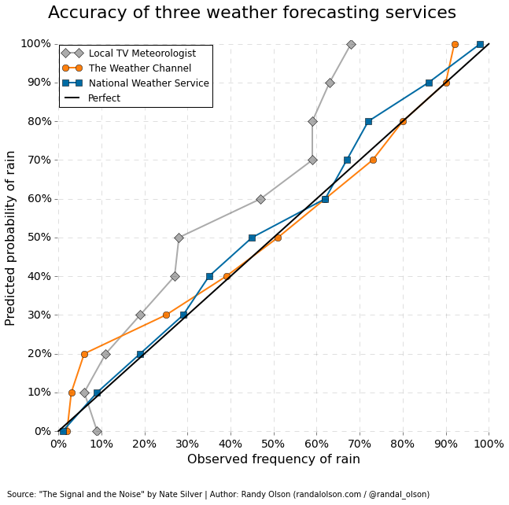

## Forecast Reminder

[Al Roker](https://en.wikipedia.org/wiki/Al_roker) is a traitor. After years of listening to that silver tongued liar, I finally have data that proves that his forecasts are a farce.

Source: http://www.reddit.com/r/dataisbeautiful/comments/28qn5h/local_weather_channels_consistently_overpredict/

Thankfully, because of friendly governmental agencies we can fight back, and glory will rain down upon us forever more.

### Your Mission

Build a Rails app to parse National Weather Service forecast data. The data is all public domain, and a REST service is available. The NWS knows that users of its API enjoy a challenge, so they created their own dialect of XML called Digital Weather Markup Language.

http://graphical.weather.gov/xml/rest.php

Some requirements to get you started:

1. As a Chicagoan, I'm only actually interested in data from Chicago itself. If you want, make the target city configurable, but don't worry about supporting arbitrary cities right now. Just make sure the code to find the correct forecast is well factored.
2. There are two pieces of information I'm really interested in:
  * Every morning, I need to know how to dress for the day. Give me an interface where I can see the next 24 hours worth of weather. Make it obvious what to do or there's a high chance I'll miss it.
  * I also like to know what the next week or so will look like. Give me that information as well.
3. To make this a little more high pressure, I should be able to register and save my contact information. If there are any important weather updates, email or text me about it early enough that I haven't already left the house.
4. A webpage is a good first interface. That said, I want to pipe this data through [IFTTT](https://ifttt.com/) so go ahead and give me a JSON feed as well. I may want to retrieve historical data as well.
5. Don't hit the NWS page every time I request the webpage, that would be rude and they'd probably block you pretty quickly. You'll need to persist the data to a database.

Strike back at that blowhard. Roker must fall.
